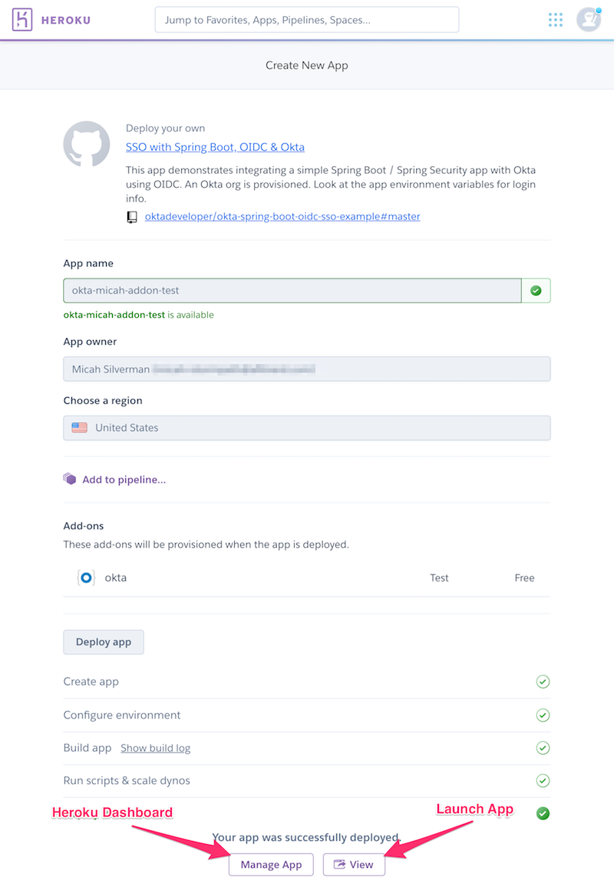
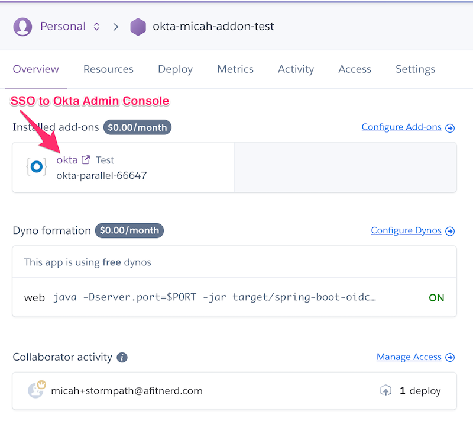
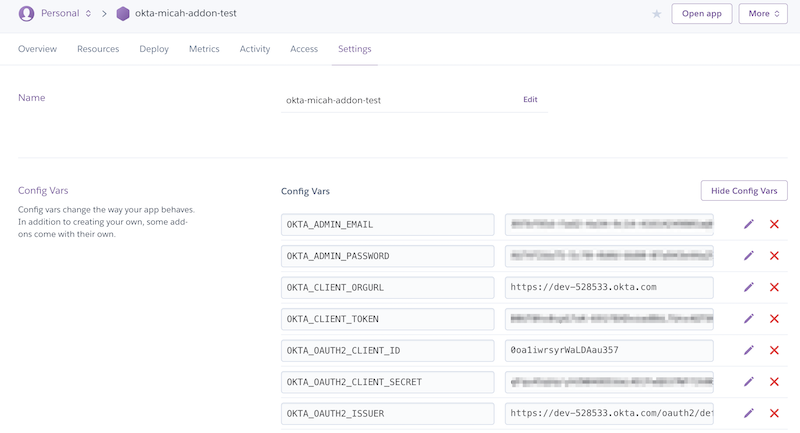

## Spring Boot + Okta

This app demonstrates integrating an Okta OpenID Connect application with Spring Boot.

You can deploy directly to Heroku and provision an Okta org at the same time!

[](https://heroku.com/deploy)

The app is already configured to integrate with your new Okta org.

When you click the purple button above, you'll give the app a unique name to run in Heroku. 

You can SSO to your Okta Admin Console from the Heroku Dashboard and, you can launch this app as shown below:

________________


____________________


You can also see the environment variables that have been set in your application as part of the Okta provisioning process:

____________________



## Single Sign-On with Spring Boot, OpenID Connect and Okta

This application also demonstrates Single Sign-On across multiple OpenID Connect applications
with multiple Authorization Servers defined in Okta.

To use this sample application, you need to create a free developer Okta org. You can do that by going to
https://developer.okta.com.

Then, you create two OpenID Connect applications in Okta and run two instances of this application. You can SSO between them!

For more detail about OpenID Connect and how to use this app, check out the blog post [here](https://developer.okta.com/blog/2019/05/02/spring-boot-single-sign-on-oauth-2).

### Build the app

run:

```mvn clean install```

### Run the app

Included in this repo is a shell script to make it easy to run the app. It works on Mac and Linux:

```
./run_app.sh \
    --ci <client id for oidc app>  \
    --cs <client secret for oidc app> \
    --is <issuer for oidc app>
```

If you're on a different system, you can also run the app directly with maven:

```
mvn spring-boot:run \
    -Dokta.oauth2.clientId=<client id for oidc app> \
    -Dokta.oauth2.clientSecret=<client secret for oidc app> \
    -Dokta.oauth2.issuer=<issuer for oidc app>
```
